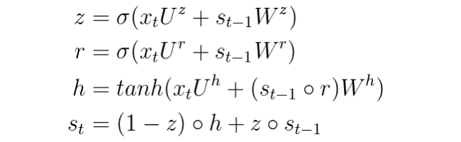
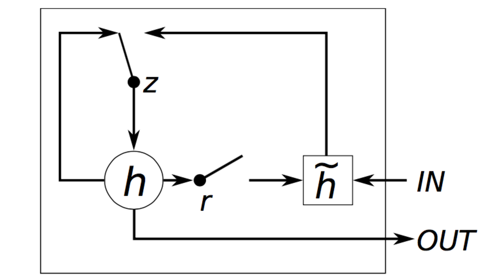

# Machine Learning Engineer Nanodegree
## Capstone Project
Zitong Guo  
September 3rd, 2017

## I. Definition

### Project Overview
Given an integer sequence: 1, 2, 3, 4, 5, ? 

So what is the next number?

7! You read that correctly. That's the start to a real integer sequence, the [powers of primes](https://oeis.org/A000961 "Click to check"). Want something easier? How about the next number in 0, 1, 1, 2, 3, 5, 8, 13, 21, 34, 55, ? If you answered 89 (in this case this is the [Fibonacci Sequence](https://en.wikipedia.org/wiki/Fibonacci_number "Click to check")), you may enjoy this challenge. Your computer may find it considerably less enjoyable. In this project, a machine learning solution will be demonstated to predict the next number of a given integer sequence.

[The On-Line Encyclopedia of Integer Sequences® (OEIS®)](https://oeis.org/ "Click to visit") is a 50+ year effort by mathematicians the world over to catalog sequences of integers. If it has a pattern, it's probably in the OEIS, and probably described with amazing detail.

The [dataset](https://www.kaggle.com/c/integer-sequence-learning/data "Click to download dataset") of this project contains the majority of the integer sequences from the OEIS. It is split into a training set, where you are given the full sequence, and a test set, where we have removed the last number from the sequence. The task is to predict this removed integer.

Note that some sequences may have identical beginnings (or even be identical altogether). They have not been removed these from the dataset.

#### File descriptions

- train.csv - the training set, contains full sequences
- test.csv - the test set, missing the last number in each sequence

### Problem Statement
This problem at hand is defined by Kaggle team's competition named [Integer Sequence Learning](https://www.kaggle.com/c/integer-sequence-learning "Click to visit"). It challenges you create a machine learning algorithm capable of guessing the next number in an integer sequence. While this sounds like pattern recognition in its most basic form, a quick look at the data will convince you this is anything but basic!

The [Recurrent Neural Networks](https://en.wikipedia.org/wiki/Recurrent_neural_network "Click to check") approach – usually just called "RNNs" - is applied to solve this problem. This task particularly interests me as it's analogous to word prediction. Hence integers are treated as words in the solution.

### Metrics
The evaluation metric for this problem is straightforward and simple. It is based on the accuracy of the predictions (the percentage of sequences where the next number is predicted correctly).


## II. Analysis

### Data Exploration
The input dataset of this project is two CSV files for `train` and `test`. It's known that for the training set, we are given the entire sequence and for the test set the final element has been removed, which is the target we are trying to predict.

Firstly, we explore the training to understand the details using R. 

```r
train <- read.csv("train.csv")
str(train)
```
```
## 'data.frame':    113845 obs. of  2 variables:
##  $ Id      : int  3 7 8 11 13 15 16 18 20 21 ...
##  $ Sequence: Factor w/ 112880 levels "-1,-1,-1,-1,-1,-1,-1,-1,8,-1,-10,-19,-28,-37,-46,-55,-64,-73,17,8,-1,-10,-19,-28,-37,-46,-55,-64,26,17,8,-1,-10"| __truncated__,..: 56405 42851 49586 69391 39594 25563 111167 53155 99989 42592 ...
```
```r
head(train)
```
```
##   Id
## 1  3
## 2  7
## 3  8
## 4 11
## 5 13
## 6 15
##   Sequence
## 1  1,3,13,87,1053,28576,2141733,508147108,402135275365,1073376057490373,9700385489355970183,298434346895322960005291,31479360095907908092817694945,11474377948948020660089085281068730
## 2  1,2,1,5,5,1,11,16,7,1,23,44,30,9,1,47,112,104,48,11,1,95,272,320,200,70,13,1,191,640,912,720,340,96,15,1,383,1472,2464,2352,1400,532,126,17,1,767,3328,6400,7168,5152,2464,784,160,19,1,1535,7424
## 3  1,2,4,5,8,10,16,20,32,40,64,80,128,160,256,320,512,640,1024,1280,2048,2560,4096,5120,8192,10240,16384,20480,32768,40960,65536,81920,131072,163840,262144,327680,524288,655360,1048576,1310720,2097152
## 4  1,8,25,83,274,2275,132224,1060067,3312425,10997342,36304451,301432950,17519415551,140456757358,438889687625,1457125820233,4810267148324,39939263006825,2321287521544174,18610239435360217
## 5  1,111,12211,1343211,147753211,16252853211,1787813853211,196659523853211,21632547623853211,2379580238623853211,261753826248623853211,28792920887348623853211
## 6  1,1,1,1,1,1,1,1,1,5,1,1,1,1,5,5,1,1,1,1,11,5,5,11,5,1,1,1,1,5,23,5,23,5,5,1,1,1,1,21,5,39,5,5,39,5,21,5,1,1,1,1,5,1,17,1,17,1,1,5,1,1,1,1,31,5,5,29,1,1,29,1,5
```
It's obersed that each row of the data contains `Id` and `Sequence`. There are totally 113,845 sequences indicated by `Id`.

For the test set, we use the same method to explore it.

```r
test <- read.csv("test.csv")
str(test)
```
```
## 'data.frame':    113845 obs. of  2 variables:
##  $ Id      : int  1 2 4 5 6 9 10 12 14 17 ...
##  $ Sequence: Factor w/ 112743 levels "-1,-1,-1,-1,-1,-1,-1,-1,0,-1,-1,-1,-1,1,-1,-1,-1,-1,0,1,-1,-1,-1,-1,-1,1,0,-1,-1,-1,-1,-1,0,2,-1,-1,-1,-1,-1,-1"| __truncated__,..: 21170 37154 8655 61789 33817 16343 33595 2584 99148 22897 ...
```
```r
head(test)
```
```
##   Id
## 1  1
## 2  2
## 3  4
## 4  5
## 5  6
## 6  9
##   Sequence
## 1  1,0,0,2,24,552,21280,103760,70299264,5792853248,587159944704
## 2  1,1,5,11,35,93,269,747,2115,5933,16717,47003,132291,372157,1047181,2946251,8289731,23323853,65624397,184640891,519507267,1461688413,4112616845,11571284395,32557042499,91602704493,257733967693
## 3  0,1,101,2,15,102,73,3,40,16,47,103,51,74,116,4,57,41,125,17,12,48,9,104,30,52,141,75,107,117,69,5,148,58,88,42,33,126,152,18,160,13,38,49,55,10,28,105,146,31,158
## 4  1,4,14,23,42,33,35,34,63,66,87,116,84,101,126,164,128,102,135,143,149,155,203,224,186,204,210,237,261,218,219,286,257,266,361,355,336,302,374,339,371,398,340,409,348,388,494,436,407,406
## 5  1,1,2,5,4,2,6,13,11,4,10,10,12,6,8,29,16,11,18,20,12,10,22,26,29,12,38,30,28,8,30,61,20,16,24,55,36,18,24,52,40,12,42,50,44,22,46,58,55,29,32,60,52,38,40,78,36,28,58,40,60,30,66,125,48,20,66,80,44,24
## 6  0,31,59,90,120,151,181,212,243,273,304,334,365,396,424,455,485,516,546,577,608,638,669,699,730,761,789,820,850,881,911,942,973,1003,1034,1064,1095,1126,1155,1186,1216,1247,1277,1308,1339,1369,1400,1430
```
We can see that the test set also has 113,845 sequences indicated by `Id`.

Hence, it's learned that we are provided with 227,690 sequences in total from the OEIS, split 50% to 50% into a training and test set. 

### Exploratory Visualization
The sequences are made up of a linear sequences, logarithmic sequences, sequences with a modulus, and many other oddities.
Firstly, we count all numbers in both sets, and then based on that to generate the illustrations regarding the count of numbers in each sequence versus its frequency in the dataset. 

The details of this feature of both training set and test set are shown as follows:


To get an idea of what kind of dataset we are working with, we can illustrate some of these sequences after merging training set and test set together and making all the sequences sorted by Id in ascending order. The first 100 sequences are shown below. Please note that the data is on a log scale.


### Algorithms and Techniques
As mentioned above, a number in a sequence is equivalent to a word. Based on this observation, we try to predict the last number based on the preceding numbers. Hence, the problem can be treated as the [Natural Language Processing (NLP)](https://en.wikipedia.org/wiki/Natural_language_processing "Click to check") domain. 

It's known that RNNs can use their internal memory to process arbitrary sequences of inputs. This makes them applicable to tasks such as unsegmented, connected [handwriting recognition](https://en.wikipedia.org/wiki/Handwriting_recognition "Click to check") or [speech recognition](https://en.wikipedia.org/wiki/Speech_recognition "Click to visit"). 

Training a RNN is similar to training a traditional Neural Network. Considering the parameters are shared by all time steps in the network, the gradient at each output depends not only on the calculations of the current time step, but also the previous time steps, we use the backpropagation algorithm to deal with it. For example, in order to calculate the gradient at the 4th step, we would need to backpropagate 3 steps and sum up the gradients. This is called Backpropagation Through Time (BPTT). For now, just be aware of the fact that vanilla RNNs trained with BPTT have difficulties learning long-term dependencies (e.g., dependencies between steps that are far apart) due to what is called the vanishing/exploding gradient problem.

To solve the problem, based on plain RNNs the [Gated Recurrent Units (GRUs)](https://en.wikipedia.org/wiki/Gated_recurrent_unit "Click to check") - a gating mechanism RNNs - will be used as the classifier to see if it can give reasonable prediction of a given sequence's last term in the test set ([Long Short Term Memory (LSTM) networks](https://en.wikipedia.org/wiki/Long_short-term_memory "Click to check") is also applicable but not used and discussed here).

The idea behind a GRU layer is quite similar to that of a LSTM layer, the equations are shown as follows.



A GRU has two gates, a reset gate `r`, and an update gate `z`.  Intuitively, the reset gate determines how to combine the new input with the previous memory, and the update gate defines how much of the previous memory to keep around. If we set the reset to all 1’s and  update gate to all 0’s we again arrive at the plain RNN model.



There’s just an additional `tanh` that squashes the output a bit. The gating mechanism is what allows GRUs to explicitly model long-term dependencies. By learning the parameters for its gates, the network learns how its memory should behave.

### Benchmark
The `Mode` methodology is used as the benchmark model for the last number prediction in a certain sequence. For this, we simply find the mode in a given sequence, and that will be our guess for the last term in the sequence. The Mode Benchmark (implemented in R) seen on the competiton [leaderboard](https://www.kaggle.com/c/integer-sequence-learning/leaderboard "Click to check") has an accuracy of `0.05746`.

```r
Mode <- function(x) {
	ux <- unique(x)
  	ux[which.max(tabulate(match(x, ux)))]
}
```

The top 20 accuracy scores of the competition leaderboard range between 0.20 - 0.59 (excluding an outlier in first place with a score of 0.98).

To be able to predict the last term with an accuracy score above 0.20 would be satisfactory, above 0.30 (top 10) would be great, and above 0.40 (top 3) would be outstanding.


## III. Methodology

### Data Preprocessing
Reading the provided CSV file produces a data frame of two variables, Id and Sequence. The Id variables are integers, and are exactly how we want them. The Sequence variable is in strings, so we will need to convert that to a list a of numbers. Combining the use of `splitlines()` and `split()` function is a simple way to make it.

### Implementation
During the training classifer stage, the classifier was trained on the preprocessed training data. The specific implementation is shown below. The dataset is read from the CSV file and then saved to disk as Python pickle file to be loaded for training the model subsequently.
 
```python
# Mapping each character with the indicated index
def load_vocab():
    vocab = 'E,-0123456789'
    digit2idx = {digit:idx for idx, digit in enumerate(vocab)}
    idx2digit = {idx:digit for idx, digit in enumerate(vocab)}
    
    return digit2idx, idx2digit 
    
def create_train_data():
    digit2idx, idx2digit = load_vocab()
    
	# Vectorize
    train_lines = [line.split('"')[1] for line in \
    open('../data/train.csv', 'r').read().splitlines()[1:]]
    test_lines = [line.split('"')[1] for line in \
    open('../data/test.csv', 'r').read().splitlines()[1:]]
            
    xs0, xs1, xs2, xs3 = [], [], [], []
    ys0, ys1, ys2, ys3 = [], [], [], []
    for i, line in enumerate(train_lines + test_lines):
        digits = line[-400:] 

        # Numbers consisting of more than five digits are excluded
        # to avoid disturbing the training process
        isvalid = True
        for num in digits.split(","):
            if len(num) > 5:
                isvalid = False
                break
        if not isvalid:
            continue
        
        x = [digit2idx[digit] for digit in digits]
        y = [digit2idx[digit] for digit in (digits[1:] + ",")]

        # Data Bucketing
        if len(x) <= 100:
            x += [0] * (100 - len(x)) # Zero postpadding
            y += [0] * (100 - len(y)) # Zero postpadding
            xs0.append(x); ys0.append(y)
        elif len(x) <= 200:
            x += [0] * (200 - len(x)) # Zero postpadding
            y += [0] * (200 - len(y)) # Zero postpadding
            xs1.append(x); ys1.append(y)
        elif len(x) <= 300:
            x += [0] * (300 - len(x)) # Zero postpadding
            y += [0] * (300 - len(y)) # Zero postpadding
            xs2.append(x); ys2.append(y)
        else:
            x += [0] * (400 - len(x)) # Zero postpadding
            y += [0] * (400 - len(y)) # Zero postpadding
            xs3.append(x); ys3.append(y)

    X = [np.array(xs0), np.array(xs1), np.array(xs2), np.array(xs3)]   
    Y = [np.array(ys0), np.array(ys1), np.array(ys2), np.array(ys3)]

    pickle.dump((X, Y), open('../data/train.pkl', 'wb'))
    
def load_train_data(num):
    X, Y = pickle.load(open('../data/train.pkl', 'rb'))
    return X[num], Y[num]
```

The training model is implemented in Python as shown below. 

```python
def build_model(seqlen):
    sequence = Input(shape=(seqlen,), dtype="int32")
    embedded = Embedding(13, 300, mask_zero=True)(sequence)
    gru1 = GRU(1000, return_sequences=True)(embedded)
    after_dp = Dropout(0.5)(gru1)
    gru2 = GRU(1000, return_sequences=True)(after_dp)
    after_dp = Dropout(0.5)(gru2)
    output = TimeDistributed(Dense(13, activation="softmax"))(after_dp)
    
    model = Model(inputs=sequence, outputs=output)
    
    return model
```

The network architecture is "Inputs -> GRU Layer 1 of 1000 hidden units -> Dropout -> GRU Layer 2 of 1000 hidden units -> Dropout -> Time distributed dense -> Outputs".

After that, the classifier is trained on the preprocessed training data as described above. And then we do necessary predictions based on the training model.

```python
for epoch in range(0, 30):
    for subepoch in range(4):
        num = epoch % 4
        
        # Load training set
        X, Y = load_train_data(num)
        Y = np.expand_dims(Y, -1)
        
        # Build model
        seqlen = X.shape[1]        
        model = build_model(seqlen)
        
        # Compile model
        model.compile('adam', 'sparse_categorical_crossentropy', \
        metrics=['accuracy'])
        
        # Train model
        model.fit(X, Y, batch_size=64, epochs=1)
```

### Refinement
As mentioned in the Implementation section, the network architecture includes two GRU layers with dropout after each one. But initially the network architecture just has one GRU layer without dropout, which will have an accuracy of below 0.10. To deal with this, one more GRU layer is added while appending dropout function after each GRU layer. Dropout will randomly drop weights in the layer it’s applied to during training and scales the weights so that the network keeps working during inference.

After the optimization, the final model is derived by subsequent training process which will have an accuracy of around 0.13 (the details will be discussed in next section).


## IV. Results

### Model Evaluation and Validation
The metrics discussed at the beginning of the investigation (the prdiction accuracy, i.e., the percentage of sequences where the next number is predicted correctly) can be applied to judge the health and validate the designed model.

The big question of this investigation, is whether this model can be used to predict the last term of a given sequence accurately. As the nature of the challenge was a contest, the predictions created by the model were submitted online on [Kaggle](https://www.kaggle.com "Click to visit") for a blind evaluation and received a decent score `0.13477`.


### Justification
In the Benchmark section the `Mode` methodology is discussed as the benchmark model for the last number prediction in a certain sequence. Compared with the Mode Benchmark with an accuracy of `0.05746`, the predictions generated by the designed model can be regarded as meeting the specification considering only the top 20 accuracy scores of the competition leaderboard are greater than 0.20.


## V. Conclusion
_(approx. 1-2 pages)_

### Free-Form Visualization
In this section, you will need to provide some form of visualization that emphasizes an important quality about the project. It is much more free-form, but should reasonably support a significant result or characteristic about the problem that you want to discuss. Questions to ask yourself when writing this section:

- _Have you visualized a relevant or important quality about the problem, dataset, input data, or results?_
- _Is the visualization thoroughly analyzed and discussed?_
- _If a plot is provided, are the axes, title, and datum clearly defined?_

### Reflection
During solving the problem, many standard techniques were applied: first, a data cleaning step to identify the dataset's features programmatically, then transforming the strings into numbers via the vectorization method, and finally building a specific model based on the dataset's characteristics. 

I found that training the classifier using the data input was the most difficult part. It's very difficult to decide the consisting layer and the hyperparameters to build the model. Some empirically-derived rules-of-thumb were taken into consideration to handle it meanwhile the final model structure was also based on multiple experiments. It's exciting to see that the final model designed for the problem achieves decent accuracy score.

As for the most interesting aspects of the project, I’m very delighted that I used RNNs to deal with this problem as I think it will be quite useful for later projects/experiments. I’m also happy about getting to use TensorFlow and Keras, as they are the most popular deep learning libraries in AI field.

### Improvement
With ample time, this investigation could be expanded by experimenting with the effects of adding more GRU layers to the classifier until it starts to overfit the training set there and arrive at a tipping point at which it loses accuracy. 

In addition, the parameters such as the dimensionality of the output space, activation function can be modified to achieve the optimal training model.

Other classifiers are always fair contestants when trying to tackle such scale issues with larger datasets. For instance, Long Short Term Memory (LSTM) networks would be a good candidate to investigate. In addition, [Natural Language Toolkit (NLTK)](http://www.nltk.org/ "Click to visit") would be a good choice to implement NLP related projects.

-----------

**Before submitting, ask yourself. . .**

- Does the project report you’ve written follow a well-organized structure similar to that of the project template?
- Is each section (particularly **Analysis** and **Methodology**) written in a clear, concise and specific fashion? Are there any ambiguous terms or phrases that need clarification?
- Would the intended audience of your project be able to understand your analysis, methods, and results?
- Have you properly proof-read your project report to assure there are minimal grammatical and spelling mistakes?
- Are all the resources used for this project correctly cited and referenced?
- Is the code that implements your solution easily readable and properly commented?
- Does the code execute without error and produce results similar to those reported?
