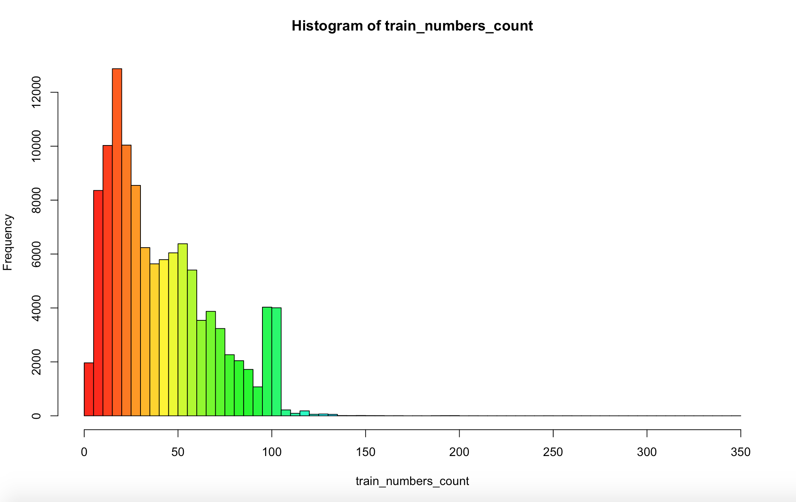
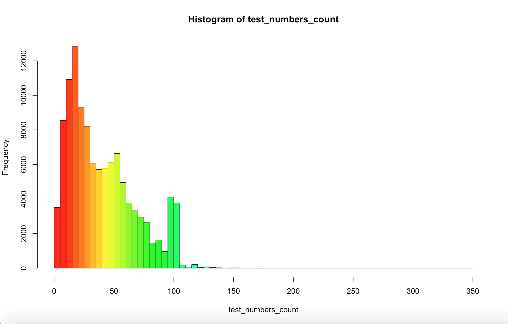
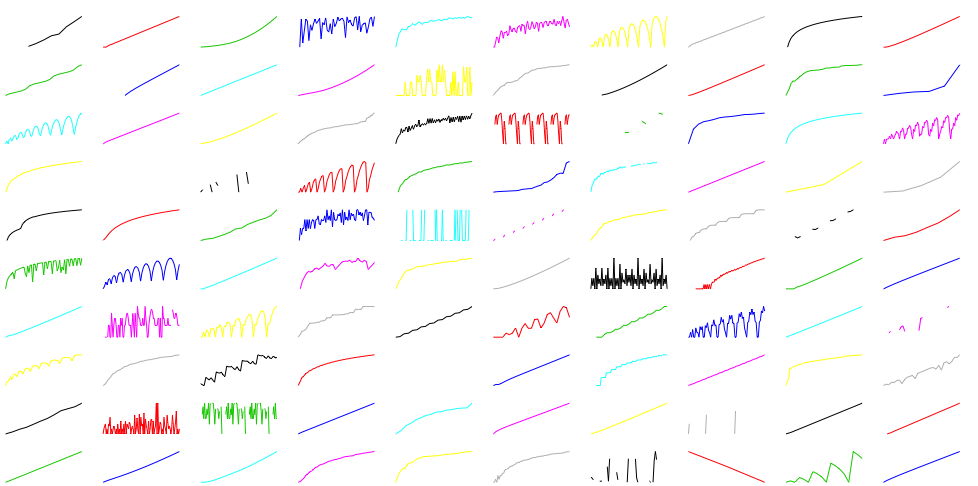

# Machine Learning Engineer Nanodegree
## Capstone Project
Zitong Guo  
September 3rd, 2017

## I. Definition

### Project Overview
Given an integer sequence: 1, 2, 3, 4, 5, ? 

So what is the next number?

7! You read that correctly. That's the start to a real integer sequence, the [powers of primes](https://oeis.org/A000961 "Click to check"). Want something easier? How about the next number in 0, 1, 1, 2, 3, 5, 8, 13, 21, 34, 55, ? If you answered 89 (in this case this is the [Fibonacci Sequence](https://en.wikipedia.org/wiki/Fibonacci_number "Click to check")), you may enjoy this challenge. Your computer may find it considerably less enjoyable. In this project, a machine learning solution will be demonstated to predict the next number of a given integer sequence.

[The On-Line Encyclopedia of Integer Sequences® (OEIS®)](https://oeis.org/ "Click to visit") is a 50+ year effort by mathematicians the world over to catalog sequences of integers. If it has a pattern, it's probably in the OEIS, and probably described with amazing detail.

The [dataset](https://www.kaggle.com/c/integer-sequence-learning/data "Click to download dataset") of this project contains the majority of the integer sequences from the OEIS. It is split into a training set, where you are given the full sequence, and a test set, where we have removed the last number from the sequence. The task is to predict this removed integer.

Note that some sequences may have identical beginnings (or even be identical altogether). They have not been removed these from the dataset.

#### File descriptions

- train.csv - the training set, contains full sequences
- test.csv - the test set, missing the last number in each sequence

### Problem Statement
This problem at hand is defined by Kaggle team's competition named [Integer Sequence Learning](https://www.kaggle.com/c/integer-sequence-learning "Click to visit"). It challenges you create a machine learning algorithm capable of guessing the next number in an integer sequence. While this sounds like pattern recognition in its most basic form, a quick look at the data will convince you this is anything but basic!

Recurrent Neural Networks – usually just called "RNNs" - is applied to solve this problem. This task particularly interests me as it's analogous to word prediction. Hence integers are treated as words in the solution.

### Metrics
The evaluation metric for this problem is straightforward and simple. It is based on the accuracy of the predictions (the percentage of sequences where the next number is predicted correctly).

## II. Analysis

### Data Exploration
The input dataset of this project is two CSV files for `train` and `test`. It's known that for the training set, we are given the entire sequence and for the test set the final element has been removed, which is the target we are trying to predict.

Firstly, we explore the training to understand the details using R. 

```r
train <- read.csv("train.csv")
str(train)
```
```
## 'data.frame':    113845 obs. of  2 variables:
##  $ Id      : int  3 7 8 11 13 15 16 18 20 21 ...
##  $ Sequence: Factor w/ 112880 levels "-1,-1,-1,-1,-1,-1,-1,-1,8,-1,-10,-19,-28,-37,-46,-55,-64,-73,17,8,-1,-10,-19,-28,-37,-46,-55,-64,26,17,8,-1,-10"| __truncated__,..: 56405 42851 49586 69391 39594 25563 111167 53155 99989 42592 ...
```
```r
head(train)
```
```
##   Id
## 1  3
## 2  7
## 3  8
## 4 11
## 5 13
## 6 15
##   Sequence
## 1  1,3,13,87,1053,28576,2141733,508147108,402135275365,1073376057490373,9700385489355970183,298434346895322960005291,31479360095907908092817694945,11474377948948020660089085281068730
## 2  1,2,1,5,5,1,11,16,7,1,23,44,30,9,1,47,112,104,48,11,1,95,272,320,200,70,13,1,191,640,912,720,340,96,15,1,383,1472,2464,2352,1400,532,126,17,1,767,3328,6400,7168,5152,2464,784,160,19,1,1535,7424
## 3  1,2,4,5,8,10,16,20,32,40,64,80,128,160,256,320,512,640,1024,1280,2048,2560,4096,5120,8192,10240,16384,20480,32768,40960,65536,81920,131072,163840,262144,327680,524288,655360,1048576,1310720,2097152
## 4  1,8,25,83,274,2275,132224,1060067,3312425,10997342,36304451,301432950,17519415551,140456757358,438889687625,1457125820233,4810267148324,39939263006825,2321287521544174,18610239435360217
## 5  1,111,12211,1343211,147753211,16252853211,1787813853211,196659523853211,21632547623853211,2379580238623853211,261753826248623853211,28792920887348623853211
## 6  1,1,1,1,1,1,1,1,1,5,1,1,1,1,5,5,1,1,1,1,11,5,5,11,5,1,1,1,1,5,23,5,23,5,5,1,1,1,1,21,5,39,5,5,39,5,21,5,1,1,1,1,5,1,17,1,17,1,1,5,1,1,1,1,31,5,5,29,1,1,29,1,5
```
It's obersed that each row of the data contains `Id` and `Sequence`. There are totally 113,845 sequences indicated by `Id`.

For the test set, we use the same method to explore it.

```r
test <- read.csv("test.csv")
str(test)
```
```
## 'data.frame':    113845 obs. of  2 variables:
##  $ Id      : int  1 2 4 5 6 9 10 12 14 17 ...
##  $ Sequence: Factor w/ 112743 levels "-1,-1,-1,-1,-1,-1,-1,-1,0,-1,-1,-1,-1,1,-1,-1,-1,-1,0,1,-1,-1,-1,-1,-1,1,0,-1,-1,-1,-1,-1,0,2,-1,-1,-1,-1,-1,-1"| __truncated__,..: 21170 37154 8655 61789 33817 16343 33595 2584 99148 22897 ...
```
```r
head(test)
```
```
##   Id
## 1  1
## 2  2
## 3  4
## 4  5
## 5  6
## 6  9
##   Sequence
## 1  1,0,0,2,24,552,21280,103760,70299264,5792853248,587159944704
## 2  1,1,5,11,35,93,269,747,2115,5933,16717,47003,132291,372157,1047181,2946251,8289731,23323853,65624397,184640891,519507267,1461688413,4112616845,11571284395,32557042499,91602704493,257733967693
## 3  0,1,101,2,15,102,73,3,40,16,47,103,51,74,116,4,57,41,125,17,12,48,9,104,30,52,141,75,107,117,69,5,148,58,88,42,33,126,152,18,160,13,38,49,55,10,28,105,146,31,158
## 4  1,4,14,23,42,33,35,34,63,66,87,116,84,101,126,164,128,102,135,143,149,155,203,224,186,204,210,237,261,218,219,286,257,266,361,355,336,302,374,339,371,398,340,409,348,388,494,436,407,406
## 5  1,1,2,5,4,2,6,13,11,4,10,10,12,6,8,29,16,11,18,20,12,10,22,26,29,12,38,30,28,8,30,61,20,16,24,55,36,18,24,52,40,12,42,50,44,22,46,58,55,29,32,60,52,38,40,78,36,28,58,40,60,30,66,125,48,20,66,80,44,24
## 6  0,31,59,90,120,151,181,212,243,273,304,334,365,396,424,455,485,516,546,577,608,638,669,699,730,761,789,820,850,881,911,942,973,1003,1034,1064,1095,1126,1155,1186,1216,1247,1277,1308,1339,1369,1400,1430
```
We can see that the test set also has 113,845 sequences indicated by `Id`.

Hence, it's learned that we are provided with 227,690 sequences in total from the OEIS, split 50% to 50% into a training and test set. 

### Exploratory Visualization
The sequences are made up of a linear sequences, logarithmic sequences, sequences with a modulus, and many other oddities.
Firstly, we count all numbers in both sets, and then based on that to generate the illustrations regarding the count of numbers in each sequence versus its frequency in the dataset. 

The details of this feature of both training set and test set are shown as follows:




To get an idea of what kind of dataset we are working with, we can illustrate some of these sequences after merging training set and test set together and making all the sequences sorted by Id in ascending order. The first 100 sequences are shown below. Please note that the data is on a log scale.



### Algorithms and Techniques
In this section, you will need to discuss the algorithms and techniques you intend to use for solving the problem. You should justify the use of each one based on the characteristics of the problem and the problem domain. Questions to ask yourself when writing this section:

- _Are the algorithms you will use, including any default variables/parameters in the project clearly defined?_
- _Are the techniques to be used thoroughly discussed and justified?_
- _Is it made clear how the input data or datasets will be handled by the algorithms and techniques chosen?_

### Benchmark
The `Mode` methodology is used as the benchmark model for the last number prediction in a certain sequence. For this, we simply find the mode in a given sequence, and that will be our guess for the last term in the sequence. The Mode Benchmark (implemented in R) seen on the competiton [leaderboard](https://www.kaggle.com/c/integer-sequence-learning/leaderboard "Click to check") has an accuracy of `0.05746`.

```r
Mode <- function(x) {
	ux <- unique(x)
  	ux[which.max(tabulate(match(x, ux)))]
}
```

The top 20 accuracy scores of the competition leaderboard range between 0.20 - 0.59 (excluding an outlier in first place with a score of 0.98).

To be able to predict the last term with an accuracy score above 0.20 would be satisfactory, above 0.30 (top 10) would be great, and above 0.40 (top 3) would be outstanding.

## III. Methodology
_(approx. 3-5 pages)_

### Data Preprocessing
In this section, all of your preprocessing steps will need to be clearly documented, if any were necessary. From the previous section, any of the abnormalities or characteristics that you identified about the dataset will be addressed and corrected here. Questions to ask yourself when writing this section:

- _If the algorithms chosen require preprocessing steps like feature selection or feature transformations, have they been properly documented?_
- _Based on the **Data Exploration** section, if there were abnormalities or characteristics that needed to be addressed, have they been properly corrected?_
- _If no preprocessing is needed, has it been made clear why?_

### Implementation
In this section, the process for which metrics, algorithms, and techniques that you implemented for the given data will need to be clearly documented. It should be abundantly clear how the implementation was carried out, and discussion should be made regarding any complications that occurred during this process. Questions to ask yourself when writing this section:

- _Is it made clear how the algorithms and techniques were implemented with the given datasets or input data?_
- _Were there any complications with the original metrics or techniques that required changing prior to acquiring a solution?_
- _Was there any part of the coding process (e.g., writing complicated functions) that should be documented?_

### Refinement
In this section, you will need to discuss the process of improvement you made upon the algorithms and techniques you used in your implementation. For example, adjusting parameters for certain models to acquire improved solutions would fall under the refinement category. Your initial and final solutions should be reported, as well as any significant intermediate results as necessary. Questions to ask yourself when writing this section:

- _Has an initial solution been found and clearly reported?_
- _Is the process of improvement clearly documented, such as what techniques were used?_
- _Are intermediate and final solutions clearly reported as the process is improved?_


## IV. Results
_(approx. 2-3 pages)_

### Model Evaluation and Validation
In this section, the final model and any supporting qualities should be evaluated in detail. It should be clear how the final model was derived and why this model was chosen. In addition, some type of analysis should be used to validate the robustness of this model and its solution, such as manipulating the input data or environment to see how the model’s solution is affected (this is called sensitivity analysis). Questions to ask yourself when writing this section:

- _Is the final model reasonable and aligning with solution expectations? Are the final parameters of the model appropriate?_
- _Has the final model been tested with various inputs to evaluate whether the model generalizes well to unseen data?_
- _Is the model robust enough for the problem? Do small perturbations (changes) in training data or the input space greatly affect the results?_
- _Can results found from the model be trusted?_

### Justification
In this section, your model’s final solution and its results should be compared to the benchmark you established earlier in the project using some type of statistical analysis. You should also justify whether these results and the solution are significant enough to have solved the problem posed in the project. Questions to ask yourself when writing this section:

- _Are the final results found stronger than the benchmark result reported earlier?_
- _Have you thoroughly analyzed and discussed the final solution?_
- _Is the final solution significant enough to have solved the problem?_


## V. Conclusion
_(approx. 1-2 pages)_

### Free-Form Visualization
In this section, you will need to provide some form of visualization that emphasizes an important quality about the project. It is much more free-form, but should reasonably support a significant result or characteristic about the problem that you want to discuss. Questions to ask yourself when writing this section:

- _Have you visualized a relevant or important quality about the problem, dataset, input data, or results?_
- _Is the visualization thoroughly analyzed and discussed?_
- _If a plot is provided, are the axes, title, and datum clearly defined?_

### Reflection
In this section, you will summarize the entire end-to-end problem solution and discuss one or two particular aspects of the project you found interesting or difficult. You are expected to reflect on the project as a whole to show that you have a firm understanding of the entire process employed in your work. Questions to ask yourself when writing this section:

- _Have you thoroughly summarized the entire process you used for this project?_
- _Were there any interesting aspects of the project?_
- _Were there any difficult aspects of the project?_
- _Does the final model and solution fit your expectations for the problem, and should it be used in a general setting to solve these types of problems?_

### Improvement
In this section, you will need to provide discussion as to how one aspect of the implementation you designed could be improved. As an example, consider ways your implementation can be made more general, and what would need to be modified. You do not need to make this improvement, but the potential solutions resulting from these changes are considered and compared/contrasted to your current solution. Questions to ask yourself when writing this section:

- _Are there further improvements that could be made on the algorithms or techniques you used in this project?_
- _Were there algorithms or techniques you researched that you did not know how to implement, but would consider using if you knew how?_
- _If you used your final solution as the new benchmark, do you think an even better solution exists?_

-----------

**Before submitting, ask yourself. . .**

- Does the project report you’ve written follow a well-organized structure similar to that of the project template?
- Is each section (particularly **Analysis** and **Methodology**) written in a clear, concise and specific fashion? Are there any ambiguous terms or phrases that need clarification?
- Would the intended audience of your project be able to understand your analysis, methods, and results?
- Have you properly proof-read your project report to assure there are minimal grammatical and spelling mistakes?
- Are all the resources used for this project correctly cited and referenced?
- Is the code that implements your solution easily readable and properly commented?
- Does the code execute without error and produce results similar to those reported?
